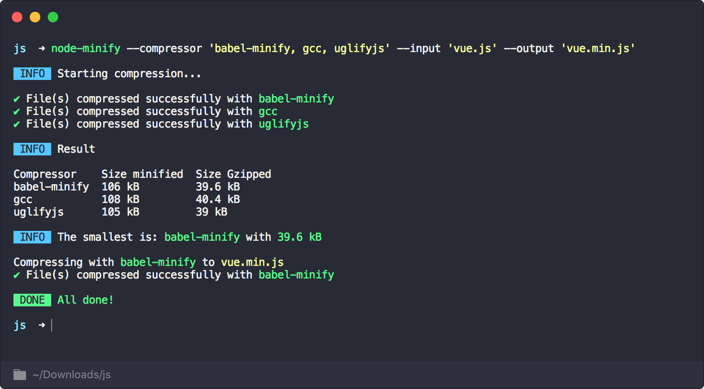

# CLI

You can compress files using the command line.

## Installation

```bash
npm install -g @node-minify/cli # OR yarn add @node-minify/cli
```

## Usage

```bash
node-minify --compressor uglify-js --input 'input.js' --output 'output.js'
```



## Options

You can pass an `option` as a JSON string to the compressor.

```bash
node-minify --compressor uglify-js --input 'input.js' --output 'output.js' --option '{"warnings": true, "mangle": false}'
```
